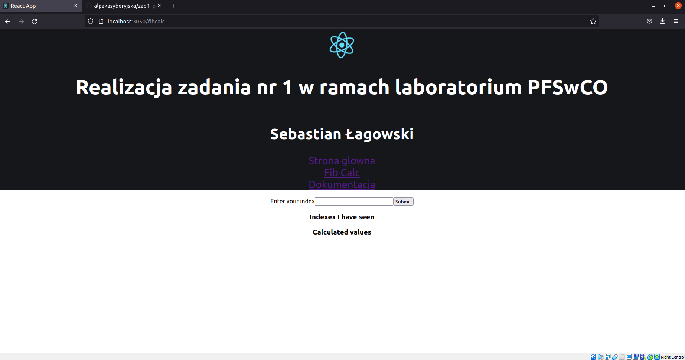

# Client server application to calculate Fibonacci values
Uses Postgres and Redis as storage. Nginx to route requests. Build with docker and docker-compose.

### Running application in developer mode
`docker-compose -f docker-compose.dev.yml up --build -d`
### To stop application in developer mode
`docker-compose -f docker-compose.dev.yml down`

## Nginx
Routes all requests that starts with `/api` to **server**. All other are directed to **client**.

## Accesing the application
To access the application go to `http://localhost:3050`

